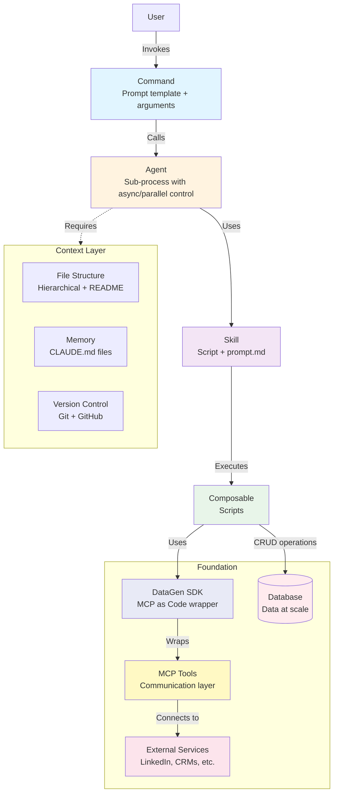
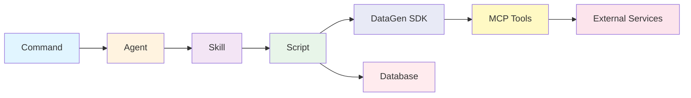

# Claude Code: From Assistant to Agent Platform

## Paradigm Shift

**Traditional usage**: Claude Code → Software
_Claude Code assists you in building software (Claude is the helper)_

**Agent platform**: Software → Claude Code agent
_You build software infrastructure to serve Claude Code agents (Software becomes the foundation for agents)_

This is the fundamental shift: from using Claude to build software for humans, to building software that empowers Claude agents to work autonomously at scale.

## Architecture Schematic

### Component Flow



### Simplified View



## Core Components

### Context Layer (Required for effective agents)
1. **File Structure**: Create a good separated, hierarchical file structure. Each folder should have a readme.md if possible
2. **Memory**: `~/.claude/CLAUDE.md`, `~/project/CLAUDE.md`, use "#" to add more, and have a good `/handoff` command for inter-session memory
3. **Version Control**: Sync across session, client using Git, GitHub, GitHub CLI

### Execution Layer
4. **Command**: Prompt template with arguments (e.g., `/commit`, `/enrich-leads`)
5. **Agents**: Sub-process with async/parallel control
6. **Skills**: Script + prompt.md combination
7. **Scripts**: The script should be composable. not the whole integrated workflow. Build good IO between scripts so it can be easily chained. 

### Foundation Layer (Tools for scale)
8. **DataGen SDK** \*: Python SDK that wraps MCP tools so they can be used as code (not just AI tools)
9. **MCP Tools**: Communication protocols for external services (LinkedIn, CRMs, etc.)
10. **Database**: Data at scale (PostgreSQL, Supabase, etc.)

## Quality of Life Improvements

1. **IDE not terminal**: Cursor/Windsurf for better developer experience
2. **Obsidian**: Markdown editing with graph visualization and backlinks
3. **MCP Gateway**: Manage MCPs at scale
4. **Useful commands**: `/compact`, `/clear`, `/askUserQuestion`

## Data Flow Example

```
User → /enrich-leads campaign.csv
  ↓
Command (parsed with arguments)
  ↓
Agent (spawned with parallel control)
  ↓
Skills (CSV parser + enrichment + CRM sync)
  ↓
Scripts (Python execution)
  ↓
DataGen SDK wraps MCP tools as Python functions
  ↓
MCP Tools → External Services (LinkedIn, CRMs)
  ↓
Results saved to Database + local files (bypass token limits)
  ↓
Results returned to User
```

###  \*Why DataGen SDK?
MCP tools have token limits when used as AI tools. DataGen SDK wraps MCPs so you can:
- ✅ Call MCPs as Python functions: `client.execute_tool("get_linkedin_posts", {...})`
- ✅ Save large outputs locally to bypass token limits
- ✅ Process data with scripts before feeding to AI
- ✅ One credential manager for all tools (like 1Password)
- ✅ Safer than env vars - AI can only access tools you grant, not raw credentials 

### Code Example
```python
from datagen_sdk import DatagenClient

client = DatagenClient()

# Use MCP as code instead of AI tool
posts = client.execute_tool(
    "get_linkedin_person_posts",
    {"linkedin_url": lead.linkedin_url}
)

# Save locally to bypass token limits
with open("./posts.json", "w") as f:
    json.dump(posts, f, indent=2)

# Claude Code can now read saved files at its own pace
``` 